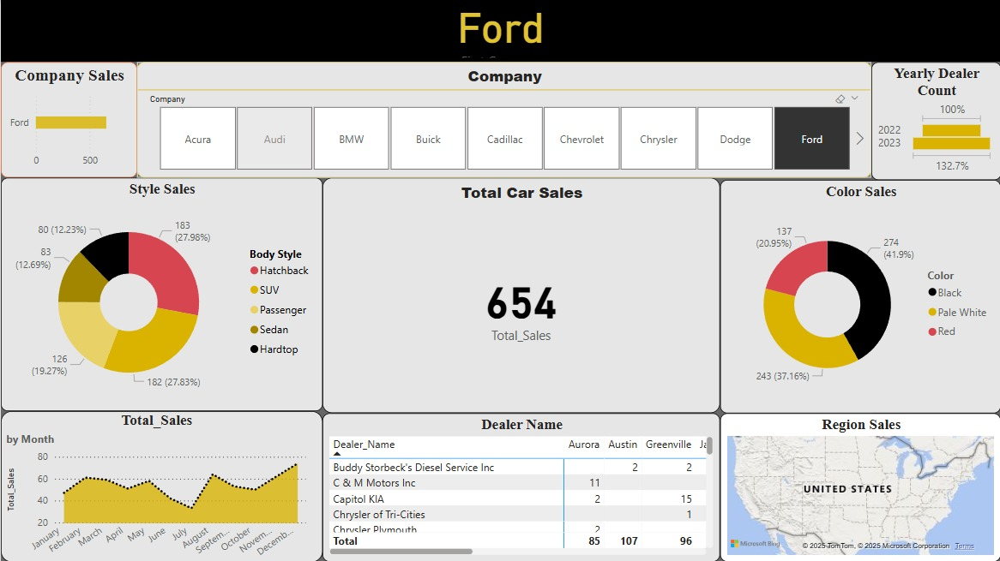

# 🚗 Car Sales Dashboard - Power BI

This *interactive Power BI dashboard* provides insights into *car sales trends*, including revenue, customer demographics, and regional performance. It helps businesses track sales metrics and make data-driven decisions.

## 📊 Dashboard Features
✅ *Total Sales & Revenue Overview*  
✅ *Top-Selling Car Brands & Models*  
✅ *Sales Trends Over Time*  
✅ *Regional Performance & Market Share*  
✅ *Customer Demographics Analysis*  

## 🛠 Tech Stack
- *Power BI* for data visualization  
- *Excel / CSV* for raw data  
- *SQL / Python* (data preprocessing)  

## 📸 Dashboard Preview  


## 📂 Dataset
The dataset includes *car sales records*, customer details, and revenue data. Sample fields:  
- Car_Brand, Model, Year  
- Sales_Amount, Revenue, Customer_Age, Region  

## 📥 How to Use
1. Clone the repository:
   ```bash
   git clone https://github.com/Jayantk24/Car_Sales_Dashboard-.git
